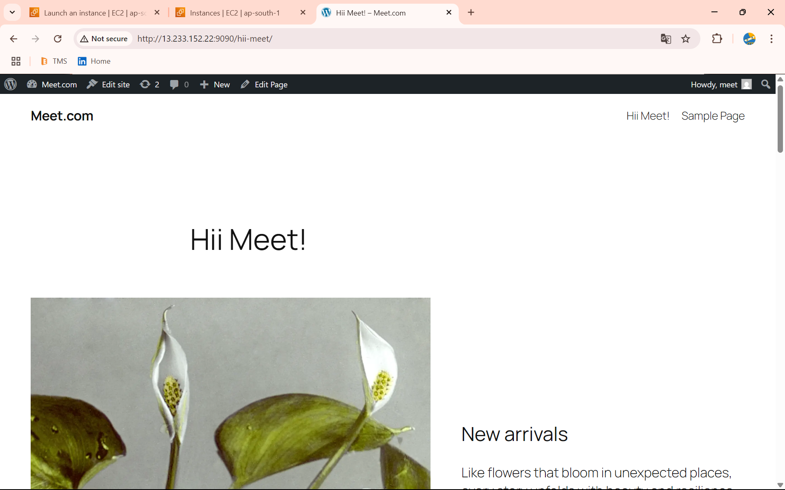

# Deploy WordPress with MySQL using Docker on AWS EC2

This project sets up a WordPress website on an AWS EC2 instance using Docker. It includes a MySQL container and a WordPress container connected via Docker.

## 🚀 Step 1 - Launch AWS EC2 Instance & Connect

1. Log in to your [AWS Console](https://aws.amazon.com/).
2. Launch a new **Ubuntu EC2 Instance**.
3. Configure Security Group:
   - Allow ports: **22**, **80**, **9090**
4. Download `.pem` file and convert to `.ppk` using PuTTYgen.
5. Connect to instance using PuTTY with `ubuntu` user.

## 🐳 Step 2 - Install Docker

```bash
sudo su
apt update && apt upgrade -y
apt install docker.io -y
service docker start
```

## 🔗 Step 3 - Docker Network Check

```bash
docker network ls
```

## 🛢 Step 4 - Run MySQL Container

```bash
docker container run -itd --name database \
  -e MYSQL_ROOT_PASSWORD=root123 \
  -e MYSQL_DATABASE=wordpress \
  -e MYSQL_ROOT_HOST='%' \
  mysql
```

## 🌐 Step 5 - Get MySQL Container IP Address

```bash
docker inspect database
```

> 🔍 Note the IP from `"IPAddress"` inside `"Networks"` → `"bridge"`

## 📰 Step 6 - Run WordPress Container

```bash
docker container run -itd -p 9090:80 --name wordpress \
  -e WORDPRESS_DB_HOST=172.17.0.2 \
  -e WORDPRESS_DB_USER=root \
  -e WORDPRESS_DB_PASSWORD=root123 \
  -e WORDPRESS_DB_NAME=wordpress \
  wordpress
```

> ⚠️ Replace `172.17.0.2` with actual IP from previous step if different.

## 🔐 Step 7 - Configure Security Group

- Go to EC2 Dashboard → Security Groups → Edit Inbound Rules
- Add Custom TCP Rule:
  - **Port Range**: `9090`
  - **Source**: `0.0.0.0/0`

## 🌍 Step 8 - Access WordPress Site

Open browser and navigate to:

```
http://<Your-EC2-Public-IP>:9090
```

## 🎉 Final Output

- WordPress Home Page
- Add New Pages
- Upload Themes & Plugins
- Ready to Publish!

## 🧹 Optional: Clean Up

```bash
docker stop wordpress database
docker rm wordpress database
```
## 🎉 Output

